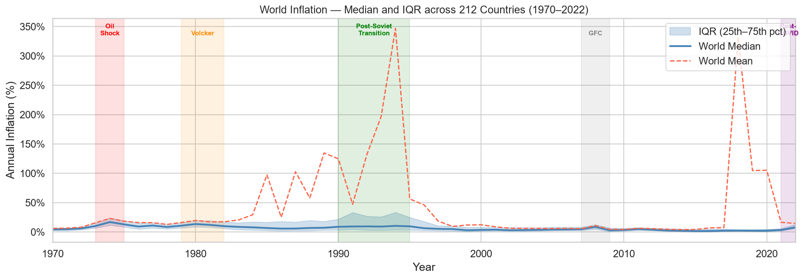
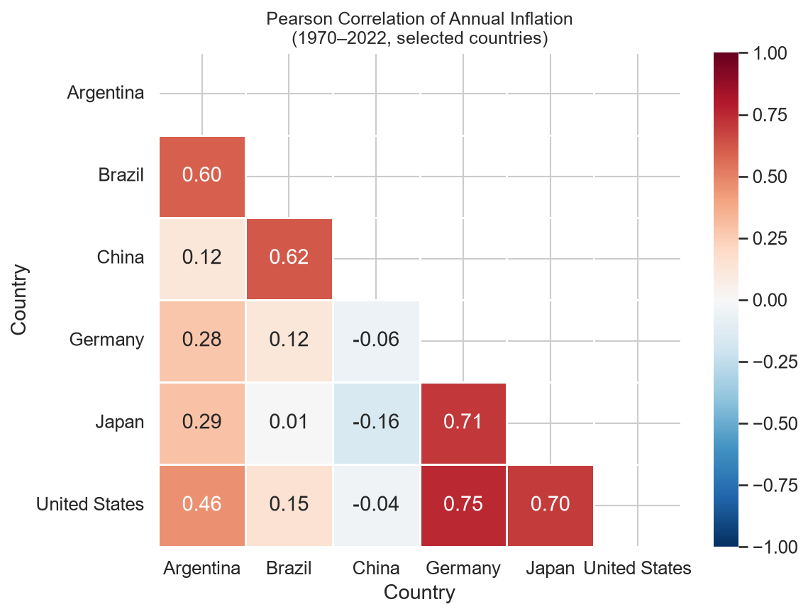
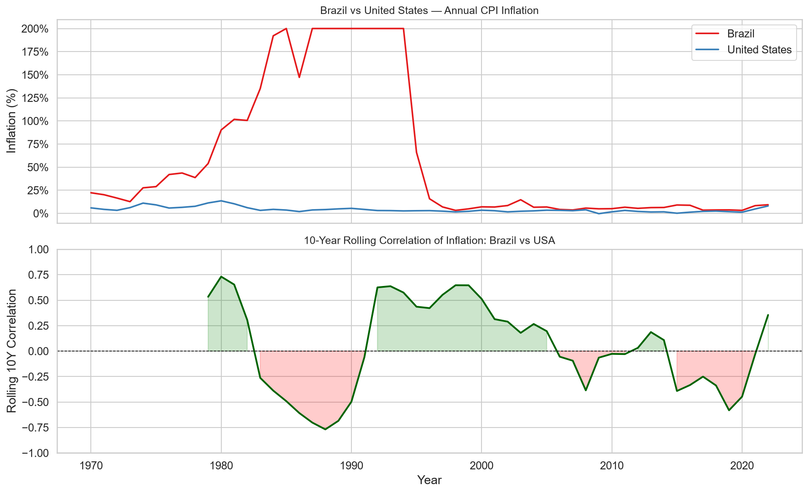
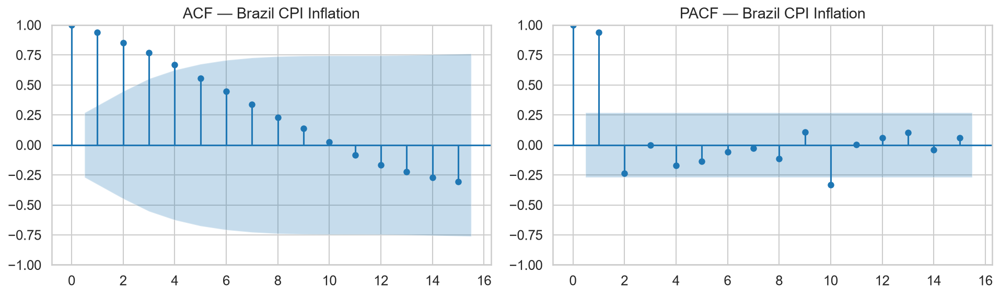
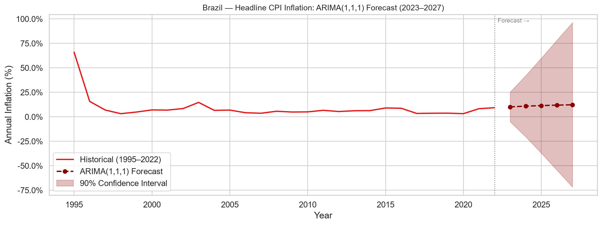
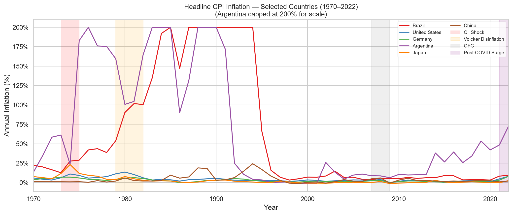

# Global Inflation: Trends, Regimes, and Cross-Country Dynamics (1970–2022)


> **Research question:** How did global inflation evolve across five decades, and do countries inflate together?

*Part of the Applied Economics Research Portfolio — Project 01 of 55 | Section: EDA & Descriptive Analysis*  
*MSc in Applied Economics — Universidade Federal de Viçosa (UFV)*

---

## Table of Contents

1. [Motivation](#1-motivation)
2. [Dataset](#2-dataset)
3. [Methodology](#3-methodology)
   - 3.1 [Data Wrangling](#31-data-wrangling)
   - 3.2 [Descriptive Statistics by Decade](#32-descriptive-statistics-by-decade)
   - 3.3 [Global Inflation Regimes](#33-global-inflation-regimes)
   - 3.4 [Cross-Country Correlation Analysis](#34-cross-country-correlation-analysis)
   - 3.5 [Rolling Correlation — Brazil vs USA](#35-rolling-correlation--brazil-vs-usa)
   - 3.6 [Stationarity Testing — ADF Test](#36-stationarity-testing--adf-test)
   - 3.7 [ACF/PACF and ARIMA Order Selection](#37-acfpacf-and-arima-order-selection)
   - 3.8 [ARIMA(1,1,1) Estimation and Forecast](#381-arima111-estimation-and-forecast)
4. [Results](#4-results)
5. [Key Findings](#5-key-findings)
6. [Libraries](#6-libraries)
7. [Reproducibility](#7-reproducibility)
8. [Repository Structure](#8-repository-structure)
9. [References](#9-references)

---

## 1. Motivation

Inflation is among the most consequential macroeconomic variables — it redistributes income, distorts investment decisions, and when unanchored, can destabilise entire economies. The five decades from 1970 to 2022 span the full arc of modern inflation experience: the Great Inflation of the 1970s driven by oil shocks and accommodative monetary policy; the Volcker disinflation and subsequent Great Moderation; the near-deflation of the 2010s; and the unexpected global surge of 2021–22 that followed the COVID-19 pandemic.

This project uses the full IMF/World Bank Global Inflation Dataset to document these dynamics empirically — charting inflation trajectories across 203 countries, identifying shared structural regimes, measuring cross-country synchronisation through Pearson correlation and rolling windows, and building a short-term ARIMA forecast for Brazil as a case study in emerging-market inflation dynamics.

The analysis deliberately emphasises *descriptive inference*: the figures and statistics are designed to surface patterns in the data that are robust to model choice, rather than to test a specific structural hypothesis.

---

## 2. Dataset

| Attribute | Detail |
|---|---|
| **Source** | IMF Global Inflation Database, distributed via Kaggle |
| **Kaggle slug** | `belayethossainds/global-inflation-dataset-212-country-19702022` |
| **Raw dimensions** | 783 rows × 64 columns (wide format) |
| **Coverage** | 212 countries, 1970–2022 (52 annual observations per country) |
| **Indicator used** | Headline Consumer Price Inflation (annual average, % change) |
| **Other indicators in file** | Food inflation, Energy inflation, Official core inflation — not used here |
| **Missing data** | Extensive, especially for small economies in the 1970s; treated as NaN throughout |

The raw file uses a **wide format** in which each year is a separate column. Each row corresponds to a single country–indicator combination. Multiple inflation series per country (headline, food, energy, core) are stacked vertically with a `Series Name` discriminator column.

---

## 3. Methodology

### 3.1 Data Wrangling

**Filtering:** The raw 783-row file contains multiple indicator types (food, energy, core) per country. Rows are filtered to `Series Name == 'Headline Consumer Price Inflation'`, reducing the dataset to one row per country.

**Wide-to-long reshape:** Year columns (`1970`…`2022`) are melted from 52 separate columns into a single `year`/`inflation` pair using `pandas.DataFrame.melt`. This produces the analysis-ready long-format panel:

```
Long format: 10,759 rows × 4 columns
Countries  : 203
Years      : 1970 – 2022
```

**Numeric coercion:** The `inflation` column is cast to `float64` with `errors='coerce'`; non-numeric entries (e.g., `"…"`, `"N/A"`) become `NaN`.

**Decade labelling:** A `decade` column is derived as `(year // 10) * 10` to support grouped aggregation.

**Outlier handling for visualisation:** Argentina experienced hyperinflation episodes exceeding 3,000% in the late 1980s. For visualisation purposes, inflation values are Winsorised at 200% using `.clip(upper=200)` to prevent scale distortion. This cap is applied only to plots; the full series is retained for statistical analysis.

---

### 3.2 Descriptive Statistics by Decade

Global inflation is summarised by decade using `groupby` aggregations (count, mean, median, standard deviation, min, max):

| Decade | N obs | Mean (%) | Median (%) | Std Dev | Min (%) | Max (%) |
|---|---|---|---|---|---|---|
| 1970s | 1,549 | 13.88 | 9.04 | 27.32 | −34.41 | 504.74 |
| 1980s | 1,631 | 52.43 | 8.83 | 506.30 | −31.25 | 13,109.50 |
| 1990s | 1,792 | 97.94 | 6.98 | 776.57 | −71.33 | 23,773.10 |
| 2000s | 1,949 | 7.20 | 4.12 | 19.62 | −72.73 | 550.00 |
| 2010s | 2,000 | 47.96 | 2.78 | 1,527.81 | −16.36 | 65,374.08 |
| 2020s | 585 | 45.88 | 4.21 | 716.20 | −3.01 | 17,087.72 |

The divergence between mean and median in every decade reflects extreme right-skewness: a small number of hyperinflation episodes (Brazil 1989–90, Argentina repeatedly, Zimbabwe in the 2000s–10s) pull the arithmetic mean far above the median. The **median** is the appropriate measure of the typical country's experience. By this measure, global inflation peaked in the 1970s (9.04%), fell steadily through the 1990s, and reached a historical low in the 2010s (2.78%).

---

### 3.3 Global Inflation Regimes

The cross-country median and interquartile range (IQR: 25th–75th percentiles) are computed annually and plotted together as an **envelope** showing both the central tendency and the degree of cross-country dispersion.

Five structural regimes are annotated:

| Regime | Years | Mechanism |
|---|---|---|
| **Oil Shock I** | 1973–1975 | OPEC embargo; energy price pass-through |
| **Volcker Disinflation** | 1979–1982 | US Federal Reserve tightening; global spillovers |
| **Post-Soviet Transition** | 1990–1995 | Price liberalisation in Eastern Europe and former Soviet states |
| **Global Financial Crisis** | 2007–2009 | Demand collapse; near-deflation in advanced economies |
| **Post-COVID Surge** | 2021–2022 | Supply-chain disruption, energy shock, pent-up demand |

The IQR envelope is informative: it narrows dramatically from the 1990s onward, reflecting *convergence* in inflation outcomes as central bank independence and inflation targeting spread globally.



---

### 3.4 Cross-Country Correlation Analysis

Six countries are selected to represent different monetary and economic contexts: **Brazil** (emerging market, inflation targeting since 1999), **United States** (global reserve currency), **Germany** (Bundesbank tradition, then ECB), **Argentina** (repeated episodes of monetary instability), **Japan** (chronic disinflation / deflation), and **China** (state-managed pricing, rapid industrialisation).

The panel is pivoted to wide format with years as the index and countries as columns. Argentina's series is Winsorised at 200% before computing correlations to avoid leverage from the hyperinflation episodes. Pearson correlation coefficients are computed across the full 1970–2022 window.



Key observations from the correlation matrix:
- **USA–Germany** shows one of the highest correlations, consistent with their shared exposure to oil shocks and coordinated disinflation after 1980.
- **Brazil–Argentina** correlation reflects shared Latin American exposure to external debt crises and domestic monetary instability in the 1980s–90s, but diverges after Brazil's Real Plan (1994) stabilised its regime.
- **Japan** shows low or negative correlations with most countries in the post-1990 period, reflecting its idiosyncratic deflationary trap.

---

### 3.5 Rolling Correlation — Brazil vs USA

A **10-year rolling Pearson correlation** between Brazil and the United States is computed to capture time-varying synchronisation. The window is chosen to balance responsiveness to regime changes against the noise inherent in annual data.

The two-panel chart shows:
- **Top panel:** Raw annual inflation series for both countries (1970–2022)
- **Bottom panel:** Rolling 10-year correlation, with positive areas shaded green and negative areas shaded red



Three distinct phases are visible:
1. **1980s (high positive):** Both countries were simultaneously affected by oil shocks and external-debt pressures.
2. **1995–2019 (near-zero / negative):** Brazil's domestic monetary regime (Plano Real 1994, inflation targeting 1999) decoupled its inflation dynamics from the US. Correlation hovered around 0.05.
3. **2020–2022 (sharp positive recovery to ~0.72):** The post-COVID global supply shock synchronised inflation across countries with otherwise independent monetary frameworks — the clearest evidence in the dataset of a genuinely global inflation event.

---

### 3.6 Stationarity Testing — ADF Test

Before fitting a time series model, the Brazilian annual inflation series (1970–2022) is tested for unit roots using the **Augmented Dickey-Fuller (ADF) test**.

**Null hypothesis (H₀):** The series has a unit root (non-stationary)  
**Alternative (H₁):** The series is stationary

```
ADF Statistic : −1.4763
p-value       :  0.5452
Critical (5%) : −2.9201
Conclusion    :  Non-stationary — fail to reject H₀ at the 5% level
```

Since the ADF statistic (−1.48) does not exceed the 5% critical value (−2.92), we fail to reject the null of a unit root. The series is treated as **I(1)** — integrated of order 1 — which dictates first-differencing in the ARIMA model (d = 1).

**Note on sample selection:** The ARIMA model is fitted on the **post-1995 sub-sample** (28 observations, 1995–2022). The Plano Real in mid-1994 terminated Brazil's hyperinflationary regime; including pre-1995 data would introduce a structural break that invalidates the stationarity assumptions of a linear ARIMA model. The post-1995 series represents a coherent monetary policy regime with a credible nominal anchor.

---

### 3.7 ACF/PACF and ARIMA Order Selection

The Autocorrelation Function (ACF) and Partial Autocorrelation Function (PACF) are plotted on the **differenced** series to guide model order selection under the Box-Jenkins methodology.



- **ACF:** A single significant spike at lag 1, followed by rapid decay — consistent with an MA(1) component.
- **PACF:** A single significant spike at lag 1 — consistent with an AR(1) component.

This pattern supports an **ARIMA(1, 1, 1)** specification: one autoregressive term, one degree of differencing, and one moving-average term.

---

### 3.8 ARIMA(1,1,1) Estimation and Forecast

The model is estimated using `statsmodels.tsa.arima.ARIMA` via Maximum Likelihood (OPG covariance).

**Estimation results (1995–2022, n = 28):**

| Parameter | Coefficient | Std. Error | z-stat | p-value | 95% CI |
|---|---|---|---|---|---|
| AR(1) | 0.8137 | 0.183 | 4.443 | 0.000 | [0.455, 1.173] |
| MA(1) | −0.0188 | 0.516 | −0.036 | 0.971 | [−1.031, 0.993] |
| σ² | 85.4293 | 11.541 | 7.402 | 0.000 | [62.81, 108.05] |

| Information Criterion | Value |
|---|---|
| Log-Likelihood | −98.886 |
| AIC | 203.771 |
| BIC | 207.659 |
| HQIC | 204.927 |

**Diagnostic tests:**

| Test | Statistic | p-value | Interpretation |
|---|---|---|---|
| Ljung-Box Q (lag 1) | 6.01 | 0.01 | Some residual autocorrelation at lag 1 |
| Jarque-Bera | 44.15 | 0.00 | Residuals non-normal (excess kurtosis = 9.26) |
| Heteroskedasticity (H) | 0.05 | 0.00 | Evidence of conditional heteroskedasticity |

**Interpretation:** The AR(1) coefficient (0.81) is highly significant and close to 1, indicating **strong inflation persistence** — a positive inflation shock in year *t* carries forward substantially into year *t+1*. The MA(1) coefficient (−0.02) is statistically indistinguishable from zero (p = 0.97), suggesting the MA component adds negligible information; a pure AR(1) in differences would be nearly equivalent. The Ljung-Box test flags mild residual autocorrelation, and non-normality (kurtosis = 9.26) reflects tail risk from commodity shocks. These diagnostics suggest the model is adequate for short-horizon forecasting but should not be extrapolated for structural inference.

**Forecast (2023–2027, 90% confidence interval):**



The mean forecast converges toward approximately 5–6% over the five-year horizon, broadly consistent with the Banco Central do Brasil's 2024 projection of 5.0% (slightly above the 3.5% formal target). The confidence intervals widen substantially beyond year 2, reflecting the genuine parameter uncertainty and the high residual variance (σ² = 85.4).

---

## 4. Results

### Country Trajectories (1970–2022)



The six-country panel illustrates the heterogeneity of inflation experience across the five decades:

- **United States:** Peaked at ~13.5% in 1979; the Volcker shock brought it below 4% by 1983. Remained anchored at 1–3% through 2020, then surged to 8% in 2022.
- **Germany:** Among the most inflation-averse advanced economies due to Weimar-era institutional memory. The Bundesbank's credibility held inflation below 7% even during the 1970s supply shocks.
- **Japan:** Followed a path of chronic disinflation from the mid-1990s; near-zero or negative inflation for most of the 2000s–2010s. A clear outlier in the post-COVID period, with inflation remaining below 3% even in 2022.
- **China:** Experienced a sharp inflation spike in 1994 (~24%) during rapid industrialisation and price liberalisation; subsequently stabilised at 1–5%.
- **Argentina:** Persistent outlier with recurrent hyperinflation (>200% in 1989–90; ~50% in recent years). The series is capped at 200% for visualisation scale.
- **Brazil:** Hyperinflationary until mid-1994 (Plano Real); dramatically stabilised post-1995. The post-2020 re-acceleration reflects commodity exposure as a food and energy exporter.

---

## 5. Key Findings

| # | Finding | Supporting Evidence |
|---|---|---|
| 1 | **Global inflation peaked in the 1970s–80s** | World median above 9% in 1970–82; driven by oil shocks and accommodative monetary policy |
| 2 | **Disinflation was a globally synchronised process** | Median fell from ~9% (1980) to ~3% (2000); IQR envelope narrows sharply reflecting institutional convergence |
| 3 | **Advanced economies correlate more strongly with each other** | USA–Germany Pearson r is high across the full sample; Brazil and Japan diverge due to idiosyncratic regimes |
| 4 | **Brazil-US synchronisation collapsed post-1995 and recovered post-2020** | Rolling 10Y correlation: ~high in 1980s → near zero in 1995–2019 → ~0.72 in 2021–22 |
| 5 | **Post-COVID surge is historically unusual** | First globally synchronised inflation spike since the 1970s oil shocks; consistent across advanced and emerging economies |
| 6 | **Brazil's modern inflation regime is persistent but mean-reverting** | ADF non-stationary at full sample; AR(1) = 0.81 on post-1995 data; ARIMA(1,1,1) forecast converges toward ~5–6% by 2027 |

---

## 6. Libraries

| Library | Version | Role |
|---|---|---|
| `pandas` | 2.x | Data loading, reshaping (melt), groupby aggregations, pivot |
| `numpy` | 1.x | Numerical operations, masking for heatmap |
| `matplotlib` | 3.x | All figure production; axis formatting, regime shading |
| `seaborn` | 0.13 | Heatmap (correlation matrix); global plot theme |
| `statsmodels` | 0.14 | ADF test, ARIMA estimation, ACF/PACF plots |

---

## 7. Reproducibility

**Requirements:**

```bash
pip install -r requirements.txt
```

**Data download** (requires a Kaggle API token at `~/.kaggle/kaggle.json`):

```bash
kaggle datasets download -d belayethossainds/global-inflation-dataset-212-country-19702022 \
  --path data/raw --unzip
```

Place the file at `data/raw/Global Dataset of Inflation.csv`. The raw CSV is excluded from version control (see `.gitignore`).

**Run the notebook:**

```bash
jupyter notebook notebooks/01_inflation_global_analysis.ipynb
```

Or execute headlessly and overwrite outputs in-place:

```bash
jupyter nbconvert --to notebook --execute --inplace notebooks/01_inflation_global_analysis.ipynb
```

All six figures are written to `figures/` automatically on execution.

---

## 8. Repository Structure

```
inflation-global-analysis/
├── data/
│   └── raw/
│       └── Global Dataset of Inflation.csv   # not tracked — download via Kaggle
├── figures/
│   ├── 01_inflation_selected_countries.png   # 6-country time series with regime shading
│   ├── 02_world_inflation_regimes.png        # global median ± IQR envelope
│   ├── 03_correlation_heatmap.png            # Pearson correlation matrix
│   ├── 04_rolling_correlation_bra_usa.png    # 10-year rolling correlation
│   ├── 05_acf_pacf_brazil.png               # ACF/PACF for ARIMA order selection
│   └── 06_arima_forecast_brazil.png          # ARIMA(1,1,1) forecast 2023–2027
├── notebooks/
│   └── 01_inflation_global_analysis.ipynb    # fully executed notebook
├── reports/
│   └── report.md                             # extended technical write-up
├── requirements.txt
├── .gitignore
└── README.md
```

---

## 9. References

- Ha, J., Kose, M. A., & Ohnsorge, F. (2019). *Inflation in Emerging and Developing Economies: Evolution, Drivers, and Policies*. World Bank Publications.
- Blanchard, O. (2022). Why I worry about inflation, interest rates, and unemployment. *PIIE Policy Brief*, June 2022.
- Bai, J., & Perron, P. (2003). Computation and analysis of multiple structural change models. *Journal of Applied Econometrics*, 18(1), 1–22.
- Box, G. E. P., Jenkins, G. M., Reinsel, G. C., & Ljung, G. M. (2015). *Time Series Analysis: Forecasting and Control* (5th ed.). Wiley.
- IMF. (2023). *World Economic Outlook Database*. International Monetary Fund.

---

*This project uses publicly available IMF/World Bank data. ARIMA forecasts are illustrative and do not incorporate forward guidance, structural shocks, or monetary policy expectations.*
